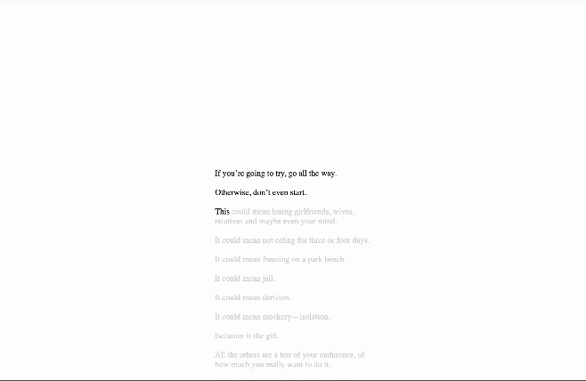

# ScrollTextHighlighter

This React component provides a dynamic text highlighting feature based on scroll position. As users scroll down the page, the text gradually illuminates, enhancing the visual appeal and user experience. The component is designed to be easily integrated into any React application, with customizable options for highlighting styles and scroll sensitivity.

Check the example, Feel Free to Follow, 
# Check my work at https://mau-portfolio-three.vercel.app/
# If you find this project, please consider starring it! :fork_and_knife: :star:

# Features:
Smooth text illumination effect on scroll.
Customizable highlighting styles.
Adjustable scroll sensitivity.
Easy integration with existing React projects.
Feel free to customize and extend the functionality as needed for your specific use case.

## Available Scripts

In the project directory, you can run:

### `npm start`

Runs the app in the development mode.\
Open [http://localhost:3000](http://localhost:3000) to view it in your browser.

